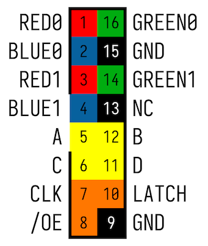
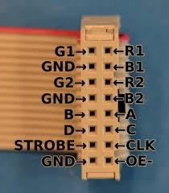
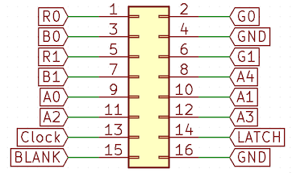

# Pin Mapping Documentation

## Table of Contents

- [Pin Mapping Documentation](#pin-mapping-documentation)
  - [Table of Contents](#table-of-contents)
  - [ESP32 Pinout](#esp32-pinout)
  - [HUB75 Pinout](#hub75-pinout)
  - [HUB75 Cable Pinout](#hub75-cable-pinout)
  - [HUB75 Schema](#hub75-schema)
  - [Solder Aid](#solder-aid)
  - [Pin Mapping Table](#pin-mapping-table)
  - [SD Card Pinout](#sd-card-pinout)

## ESP32 Pinout

## HUB75 Pinout

## HUB75 Cable Pinout

## HUB75 Schema

## Solder Aid

## Pin Mapping Table

| ESP32 Pin | HUB75 Pin | Color  | Description             |
| --------- | --------- | ------ | ----------------------- |
| 32        | R1        | Yellow | Red data (upper half)   |
| 23        | G1        | Blue   | Green data (upper half) |
| 33        | B1        | Orange | Blue data (upper half)  |
| 25        | R2        | Red    | Red data (lower half)   |
| 22        | G2        | Grey   | Green data (lower half) |
| 26        | B2        | Brown  | Blue data (lower half)  |
| 27        | A         | Black  | Address line A          |
| 16        | B         | Orange | Address line B          |
| 14        | C         | Grey   | Address line C          |
| 4         | D         | Red    | Address line D          |
| 21        | E         | Purple | Address line E          |
| 12        | CLK       | White  | Clock signal            |
| 15        | LAT       | Brown  | Latch signal            |
| 13        | OE        | Orange | Output enable           |

## SD Card Pinout

| ESP32 Pin | SD Card Pin | Description         |
| --------- | ----------- | ------------------- |
| 17        | CS          | Chip Select         |
| 5         | MOSI        | Master Out Slave In |
| 18        | SCK         | Serial Clock        |
| 19        | MISO        | Master In Slave Out |
| 3.3V      | VCC         | Power               |
| GND       | GND         | Ground              |
